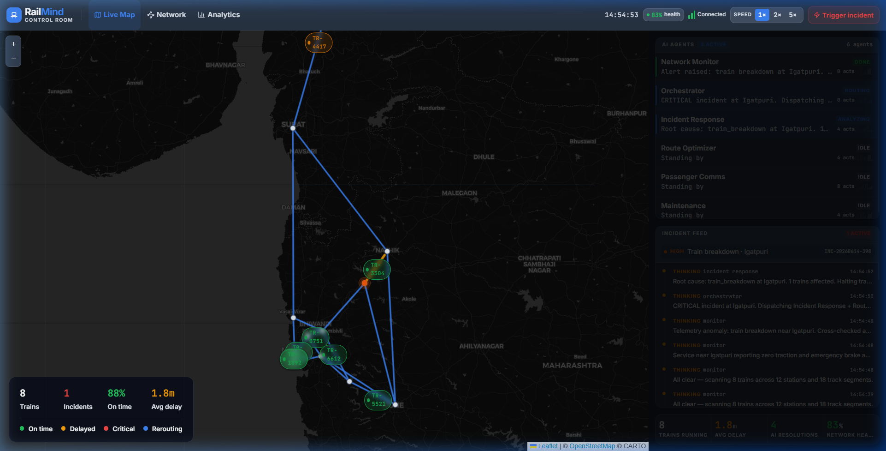

# RailMind — Smart Rail Control Room 🚆🤖

**The Brain Behind Every Train**

RailMind is a multi-agent AI control room that autonomously monitors, decides, and resolves railway incidents on a simulated Indian rail network. Coordinated by a Master Orchestrator, five specialized agents — Monitor, Incident Response, Route Optimizer, Passenger Comms, and Maintenance Scheduler — work in tandem. 

The application supports a **Live AI Mode** powered by Anthropic's Claude with tool-use/function calling, as well as a robust **Scripted Demo Fallback Mode** if no Anthropic API key is provided.



---

## 🏗️ Architecture

```
┌─────────────────────────────────┐         ┌─────────────────────────────────┐
│     React 19 Control Room UI    │   WS    │         FastAPI Backend         │
│  ┌───────────────────────────┐  │ ◄─────► │  ┌───────────────────────────┐  │
│  │   Leaflet Map (Live)      │  │         │  │   Simulation Engine       │  │
│  │   Live AI Agents Console  │  │  REST   │  │   Background Monitor Loop │  │
│  │   Active Incident Feed    │  │ ◄─────► │  │   Orchestrator + Agents   │  │
│  │   Analytics & Graphs      │  │         │  └───────────────────────────┘  │
│  └───────────────────────────┘  │         │                                 │
└─────────────────────────────────┘         └─────────────────────────────────┘
```

---

## 🚀 Step-by-Step Local Setup

### Prerequisites
Make sure you have the following installed on your machine:
* **Node.js** (v18+)
* **Python** (v3.9+)
* **npm** or **bun** package manager

---

### Step 1: Run the Backend (Python)

1. Open your terminal and navigate to the `backend` folder:
   ```bash
   cd backend
   ```
2. Create and activate a virtual environment (optional but recommended):
   ```bash
   # On Windows (PowerShell/CMD)
   python -m venv venv
   .\venv\Scripts\activate

   # On Linux/macOS
   python3 -m venv venv
   source venv/bin/activate
   ```
3. Install the required dependencies:
   ```bash
   pip install -r requirements.txt
   ```
4. Copy the environment template file:
   ```bash
   cp .env.example .env
   ```
5. *(Optional)* Open the `.env` file and set your `ANTHROPIC_API_KEY` to enable live LLM reasoning for the agents. If left blank, the app will run in fallback simulation mode.
6. Start the server using Uvicorn:
   ```bash
   python -m uvicorn main:sio_asgi_app --reload --port 8000
   ```
   The backend will start and run on **`http://localhost:8000`**.

---

### Step 2: Run the Frontend (React + Vite)

1. Navigate to the project root directory (from `backend`, run `cd ..`).
2. Install the frontend dependencies:
   ```bash
   npm install
   ```
3. Run the Vite development server:
   ```bash
   npm run dev
   ```
4. Open your browser and navigate to the address shown in the terminal (usually **`http://localhost:8080`** or `http://localhost:5173`).

---

## 🎮 How to Use & Walkthrough

Once you have both servers running and the dashboard open in your browser, follow these steps to experience the AI control room:

### 0. Take the Guided Tour 🗺️
* On your first visit, an interactive **guided onboarding tour** will launch automatically to walk you through the key interface controls.
* You can reopen this guide at any time by clicking the **`?`** icon in the header next to the speed controls.

### 1. Observe the Live Network
* Look at the **Live Map**. You will see 8 trains moving in real time between 12 key stations along the Mumbai–Pune–Gujarat corridor.
* In the bottom-left corner, observe the live metrics: **Total Trains**, **Active Incidents**, **On-Time Rate**, and **Average Delay**.
* On the right-hand panel, notice the **AI Agents Console** with all 6 agents (Orchestrator + 5 sub-agents) in their `IDLE` or `SCANNING` states.

### 2. Speed Controls
* Adjust the simulation speed to see the trains move faster. 
* Click the **1× / 2× / 5×** speed buttons in the top header or press keys `1`, `2`, or `5` on your keyboard to speed up the ticking engine.

### 3. Trigger a Demo Incident
* Click the **🔴 Trigger Incident** button in the header (or press keyboard key `D`).
* This injects a **train breakdown / signal failure** on the Kalyan Junction corridor.
* Immediately, you will see:
  1. The **Network Monitor** agent status change to `ANALYZING` as it parses telemetry.
  2. A new active incident appear in the **Incident Feed** at the bottom-right.
  3. The **Master Orchestrator** waking up to coordinate the incident response.

### 4. Watch the Multi-Agent Resolution
Watch the live log stream in the **Incident Feed** as the agents collaborate:
* **Incident Response**: Halts approaching trains on the segment to avoid collision risks.
* **Route Optimizer**: Reroutes other trains (e.g. TR-8751) via alternative bypass lines.
* **Passenger Comms**: Sends passenger announcements and updates station departure boards.
* **Maintenance Scheduler**: Books emergency repair crews and applies speed caps.
* **Master Orchestrator**: Completes the incident resolution and restores standard routing.

### 5. Check the Analytics
* Click the **Analytics** tab in the top navigation bar.
* Review the graphs displaying the **Network Health Score**, **Average Train Delay**, and **Incident Resolution Times** changing dynamically.

---

## 🤖 The AI Agents & Roles

| Agent | Responsibility |
| :--- | :--- |
| **Master Orchestrator** | Handles classification, sequences sub-agent dispatches, and logs resolution. |
| **Network Monitor** | Scans live telemetry across tracks every 8 seconds to detect anomalies. |
| **Incident Response** | Analyzes root causes, executes emergency halts, and coordinates safety measures. |
| **Route Optimizer** | Adjusts schedules and routes trains to bypass closed segments. |
| **Passenger Comms** | Broadcasts delay announcements and updates station display screens. |
| **Maintenance Scheduler** | Books technicians and schedules track-maintenance windows. |

---

## 🛠️ Tech Stack

* **Frontend:** React 19, Vite, TanStack Start, Tailwind CSS, Leaflet, Recharts, Socket.IO Client, Framer Motion
* **Backend:** Python FastAPI, python-socketio, Anthropic SDK (Claude Sonnet 3.5), Pydantic, Uvicorn, asyncio
